# RISCV-CPU-for-Course
This is a RISCV-CPU designed by Verilog for the course of ACM's class, Shanghai Jiaotong University.

assignment homepage: [ACMClassCourses/RISCV-CPU: MS108 Course Project, SJTU ACM Class. (github.com)](https://github.com/ACMClassCourses/RISCV-CPU)

